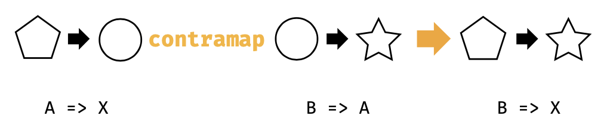

## 3.8 另外一面:部分统一

在3.2节，我们看到了奇怪的编译器错误。下面的代码如果我们增加 **-Ypartial-unification** 编译器标志那么就可以完美的编译通过：

`import cats.Functor
import cats.instances.function._
import cats.syntax.functor._

val func1 = (x: Int) => x.toDouble
val func2 = (x: Double) => y * 2
val func3 = func1.map(func2)`

如果取消  **-Ypartial-unification** 编译器标志， 那么就会编译出错。

很明显，"部分统一"是一种可选的编译器行为，不做标记我们的代码将不能编译通过。我们花费一点时间来学习一下这种行为，并且相关的方法。

### 3.8.1 统一类型构造器

为了编译类似于 func1.map(func2)的表达式，编译器将会为Function1查找Functor。然而，Functor需要接收一个参数的类型构造器：
`trait Functor[F[_]]{
  def map[A, B](fa: F[A])(func: A => B):F[B]
  }`

并且Function1有两个类型参数(函数参数和结果类型)：

`trait Function1[-A, +B]{
  def appli(arg: A):B
  }`

编译器不得不修复Function1的两个参数，并且给Functor传入正确类型的类型构造器。它有两个选择：

`type F[A] = Int => A
type F[A] = A => Double`

我们知道前面的一个是正确选择。然而，Scala编译器的早期版本并不能推断出这一点。这种"非著名"限制，编号为SI-2712，可以组织不同类型构造的"统一"。这个编译器限制目前已经被修复，尽管我们还是需要通过给build.sbt增加一个标记来完成：

`scalacOptions += "-Ypartial-unification"`

### 3.8.2 从左到右的消除

Scala编译器中的部分统一通过从左到右修复类型参数来开展工作。在上述的例子中，编译器在Int=>Double修复Int，查找类型Int=>?的函数的Functor：

`type F[A] = Int => A
val functor = Functor[F]`

这种从左到右消除可以适用于非常宽泛的场景，包括Function1和Either这种类型的Functor。

`import cats.instances.either._
val either: Either[String, Int] = Right(123)
either.map(_ + 1)`

然而，在某种条件下，从左到右的消除并非正确选项。其中一个例子就是Scalactic中的Or类型，其按惯例是Either的右基(left-biased):

`type PossibleResult = ActualResult Or Error`

另外一个例子是Function1的逆变 functor。
当Function1的协变 Functor实现andThen风格的从左到右函数组合的时候，逆变functor实现compose风格的从由到左组合。换句话说，下面的表达都是相同的：

`val func3a: Int => Double  = a => Func2(func1(a))

val func3b: Int => Double = func2.compose(func1)

val func3c: Int => Double = func2.contramap(func1)
`

如果你实际上这么干，这些代码不能编译：

`import cats.syntax.contravariant._

val func3c = func2.contramap(func1)`

图3.7 类型图：contramap遍历Function1

这里的问题是Function1的逆变修复了返回类型，并且留下了参数类型，需要编译器从右到左消除类型参数，在图3.7中可以看到：

`type F[A] = A => Double`

编译器失败的原因简而言之是因为其从左到右的偏差。我们可以通过创建一个类型同名翻转Function1的参数来证明这一点：

`type <=[B, A] = A => B
type F[A] = Double <= A`

如果我们重新将func2作为<=的实例，我们充值消除所需的顺序，就可以这样调用contramap：

`val func2b: Double <= Double = func2
val func3c = func2b.contramap(func1)`

func2和func2b之间的差异是纯语法的，都引用到相同的值，并且类型别名也完全兼容。难以置信的是，这个简单的重新定相可以足够提示编译器需要解决这个问题。

我们不得不处理这种从右到左的消除的情况是非常罕见的。大部分多参数类型构造器被指定到右基需要从左到右消除以便于被编译器用来支持拆包。然而，了解 -Ypartial-unification机制是非常有用的，这种怪异的消除顺序可能在某个情况下出现。

#

##
