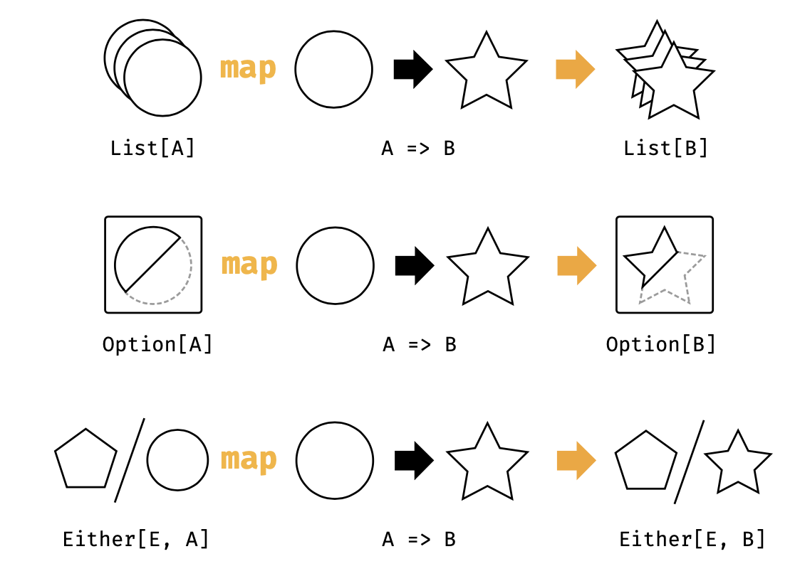
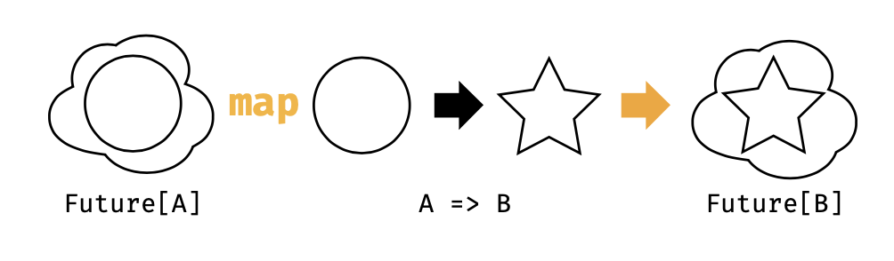

## 3.1 Funtor的例子

我们可以非正式的认为，一个 **functor** 其实就是带有 **map** 方法的任何东西。你可能了解很多种类型都有这个特定：**Option**， **List**，以及 **Either**，并且还可以罗列出不少。
我们第一次偶遇 **map** 的典型场景是迭代 **List** 。为了理解 **functor**，我们需要另辟蹊径来思考这个方法。不同于遍历一个列表，我们需要考虑在一次动作中转换这个列表中的所有值。列表的结构不随着值的变化而变化：

` List(1, 2, 3).map(n => n + 1)
// res0: List[Int] = List(2, 3, 4)`

类似的，当我们对一个 **Option** 做map的时候，我们会转换内容，但是留下的 **Some** 或者 **None** 的上下文是不变的。类似的原则也同样适合于 **Either** 留下来的 **Left** **Right** 上下文。下图描述了这种类型签名的通用转换。

图3.1:类型图：List，Option和Either的map操作

因为 **map** 留下的上下文结构没有被改变，我们就可以对一个初始化数据的结构重复的调用序列计算：

图3.2:类型图：Future的map操作

+ Option有一个值或者没有；
+ Either可能有一个值或者一个错误；
+ List可能没有值或者有多个值。

#
