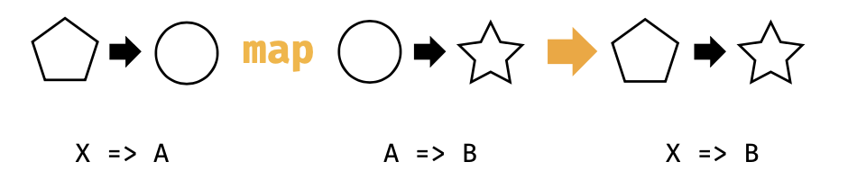
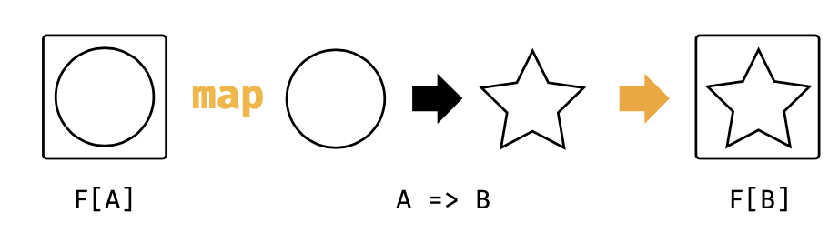

## 3.2 Functor的更多例子

**List**，**Option**，和 **Either** 的map函数实现了序列功能。然而，序列计算的思想与此相比更加通用。让我们深入研究其他以不同方式应用了这个模式的 **functor** 的行为。

#### Futures

**Future** 是一种 **functor**，其通过排序并在前置处理完成之后按顺序进行异步计算。它的map方法的类型签名在图3.2中，和上面的签名一样。但是，其行为却是不同的。

当我们使用 **Future** 的时候，我们无法确保其内部的状态。被封装的计算过程可能是正在计算当中，完成或者被拒绝这三种状态之一。如果 **Future** 已经完成，那么map方法将会立即被调用。如果没有，某些下层的线程池将会将函数调用序列化，并且在后面返回调用。我们并不知道我们的函数什么时候可以被调用，但是我们知道他们被调用的顺序。这种情况，**Future** 提供了和List，Option和Either相同的序列行为：

`import scala.concurrent.{Future, Await}
import scala.concurrent.ExecutionContext.Implicits.global
import scala.concurrent.duration._
val future: Future[String] = Future(123).
map(n => n + 1). map(n => n * 2). map(n => n + "!")
Await.result(future, 1.second)`

> #### Future 和引用透明
> 请注意，Scala的Future并非一个纯函数式编程的好例子，因为他们并非引用透明。Future会计算并且缓存结果，我们没有办法一窥其行为。这就意味着，当我们使用Future来包含副作用计算的时候，无法预测到结果。举个例子：

> `import scala.util.Random
val future1 = {
  // Initialize Random with a fixed seed:
  val r = new Random(0L)
// nextInt has the side-effect of moving to // the next random number in the sequence:
  val x =  Future(r.nextInt)
  for {
    a <- x
    b <- x
    } yield (a, b)
}
  val future2 = {
  val r = new Random(0L)
  for {
    a <- Future(r.nextInt) b <- Future(r.nextInt)
    } yield (a, b)
  }
val result1 = Await.result(future1, 1.second)
// result1: (Int, Int) = (-1155484576,-1155484576)
val result2 = Await.result(future2, 1.second)
// result2: (Int, Int) = (-1155484576,-723955400)`

> 理想状况，我们会以为result1和result2包含相同的值。然而，future1直调用了nextInt 1次，而future2调用了2次。因为nextInt每次都会返回不同的结果，因此在这每个例子中我们都会得到一个不同的结果。
这种差异性是程序很难解决Future和副作用的原因。当然还有Future行为的其他问题，比如Future总是立即开启，而不是在程序运行的时候允许用户决定。更多的信息请参考优秀的Reddit

图3.3 类型图： mapping over a Function1

回答作者Rob Norris。

如果Future不是引用透明的，也许我们可以研究一下其他类似数据类型。你可能认识这个...

#### Functions (?!)

单参数的函数也是 **functor**。为了理解方便，我们对这些类型稍做一点调整。一个函数 A => B 有两个类型参数：参数类型A和返回类型B。为了使得他们符合这个规则，我们可以修复参数类型，并让返回类型不同：

+ 以X=>A为开始；
+ 提供一个A=>B函数；
+ 获得返回X=>B。

如果我们给X => A取个别名为MyFunc[A]，我们可以看到这和本章节其他例子里面所看到的类型模式是相同的。我们也可以在图3.3中看到：

+ 以MyFunc[A]开始;
+ 提供A=>B函数;
+ 获得返回MyFunc[B].

也就是说，Function1其实就是一个函数组合：

`import cats.instances.function._ // for Functor import cats.syntax.functor._ // for map
val func1: Int => Double = (x: Int) => x.toDouble
val func2: Double => Double =
  (y: Double) => y * 2
(func1 map func2)(1) // composition using map // res7: Double = 2.0
(func1 andThen func2)(1) // composition using andThen // res8: Double = 2.0
func2(func1(1)) // composition written out by hand // res9: Double = 2.0`

这与序列操作的通用模式又有何关系？如果我们考虑到函数组合实际上就是序列。每次以执行单个操作来启动一个函数，并使用map来将另外一个操作追加到链条后面。调用map并不会有实际的操作，如果我们能够将一个参数传递到这个所有操作的运行的序列最后一个函数。我们可以将其当作和Future的懒序列操作类似：

`val func =
((x: Int) => x.toDouble).
map(x => x + 1). map(x => x * 2). map(x => x + "!")
func(123)
// res10: String = 248.0!`

> 部分统一

>为了让上述的例子可以工作，我们需要给编译器增加选项，给build.sbt增加：

`scalacOptions += "-Ypartial-unification"`

> 否则，编译器会出错：

> 

图3.4:类型图，通用functor map

> `func1.map(func2)
// <console>: error: value map is not a member of Int => Double // func1.map(func2)`

> 我们会在第3.8节看到这部分内容。

#
