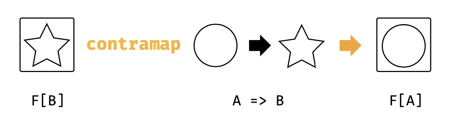
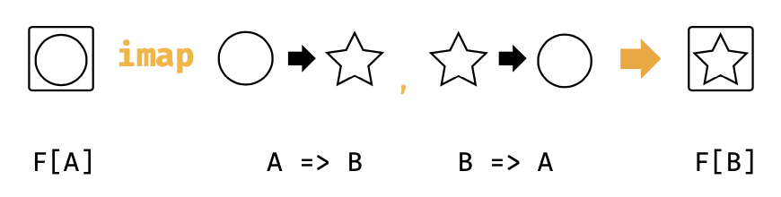

## 3.6 逆变和不变Functor

正如我们所见，我们可以将Functor的map方法看作是对一个链 **后置附加** 一个转换。我们现在再看两个其他类型类，一个代表对链的 **前置附加**，一个代表构建 **双向** 链表操作。他们各自被称之为 **逆变functor** 和不变 **functor** 。

> ### 这部分是可选的

>你无需知道理解 **monad** 的逆变和不变functor，他们是这本书以下一部分的章节的最重要的模式。然而逆变和不变我们会在第6章的Semigroupal和Applicative的讨论中顺手进行讨论。

图3.5:类图:contramap 方法

如果你现在就想了解monad，那么请直接跳到第4章，并在开始第6章之前回来到这里。

### 3.6.1 逆变Functor和contramap方法

这是我们第一个类型类，即逆变Functor，提供了一个叫做contramap的方法，表示对一个链进行 **前置附加** 的操作。其通用类型签名在图3.5所示。

contramap方法仅仅可以理解为表示转变的数据类型。举个自立，我们不能对一个Option定义contramap，因为没有办法在一个Option[B]通过一个方法 A=>B 来反向输入一个值。然而，我们可以在我们在第1章中讨论的Printable类型类中定义一个contramap：

`trait Printable[A]{
   def format(value:A):String
  }`

一个Printable[A]表示从A到字符串的转换。其contramap方法接受一个类型为 B=>A的方法， 并且创建一个新的Printable[B]:

`trait Printable[A]{
  def format(value:A):String
  def contramap[B](func:B=>A):Printable[B]=???

  }
  def format[A](value: A)(implicit p:Printable[A]):String = p.format(value)
  `

  #### 3.6.1.1:演示Contramap

  上面是对Printable的contramap方法的实现。我们用下面的代码模版来替换???，就可以得到可以工作的方法体：

  `trait Printable[A]{
    def format(value: A):String
    def contramap[B](func: B=>A): Printable[B] = new Printable[B]{
      def format(value: B):String = ???
    }
    }`

  如果在这里卡壳了，仔细考虑一下这个方法。这里需要转换一个值，将类型B转换为String。那么什么方法或者函数以及以什么顺序来完成需要的组合？

  下面是具体实现。我们调用func来将B转换为A，并且使用最初的Printable将A转换为String。为了灵活方面处理，我们使用别名self来区分Printable的内部和外部：

  `trait Printable[A]{
    self =>
    def format(value: A):String

    def contramap[B](func: B => A):Printable[B] = new Printable[B]{
      def format(value: B):String =
        self.format(func(value))
    }

    }

    def format[A](value: A)(implicit p:Printable[A]):String = p.format(value)`

为了测试的目的，让我们为String和Boolean的Printable定义相同的实例：

`implicit val stringPrintable: Printable[String] = new Printable[String]{
  def fomrat(value: String):String = "\"" + value + "\""
  }
implicit val booleanPrintable: Printable[Boolean] = new Printable[Boolean]{
  def format(value: Boolean): String = if(value) "yes" else "no"
  }

format("hello")
format(true)`

现在定义下面要讲的Box用例类的Printable实例。我们需要写一个在1.2.3节中描述过的implicit def:

`final case class Box[A](value: A)`

不同于从所有细节开始的全新定义，我们可以通过应用一个存在的实例的contramap来创建你的实例。

#### C.3 contramap第二部分

为了让这个实例可以泛化到所有Box的类型，我们将它基于Box内部的Printable所有类型。我们可以手写完整的定义：

`implicit def boxPrintable[A](implicit p: Printable[A]) = new Printable[Box[A]]{
  def format(box: Box[A]):String = p.format(box.value)
  }`

或者，我们在隐式转换参数上基于新的实例来使用contramap：

`implicit def boxPrintable[A](implicit p: Printable[A]) = p.contramap[Box[A]](_.value)`

使用contramap更加简单，并且更能体现函数式编程通过组合纯函数块来构建解决方案的方法。

你的实例可以以如下方式来工作：

`format(Box("hello world"))
format(Box(true))`

如果Box内部的类型没有Printable，那么调用format将会导致编译错误。

## 3.6.2不变funtor和imap方法

不变functor实现了一个叫做imap的方法，这个方法类似等价于map和contramap。如果map通过对一个链后置附加一个函数来产生一个新的类型实例，而contramap是通过链前置附加，那么imap则通过一组双向转换来产生。

这里有一个类型类可以作为非常直观的例子，这个类型类表示对某个数据类型进行编解码，比如Play JSON的Format和scodec的Codec。我们通过增加Printable来支持将数据类型编码为String或者将String解码为数据类型，来构建我们自己的Codec：

`trait Codec[A]{
  def encode(value: A):String
  def decode(value: String):A
  def imap[B](dec: A => B, enc: B => A):Codec[B] = ???
  }

  def encode[A](value: A)(implicit c:Codec[A]):String=c.encode(value)

  def decode[A](value: String)(implicit c:Codec[A]):A = c.decode(value)`

  

图3.6 类型图：imap方法

图3.6是imap的类型图。如果我们有一个Condec[A]和一对函数A=>B，B=>A以及imap方法创建一个Codec[B]:作为一个例子用例，想象一下我们还有一个基础的Codec[String]，这个Codec其实encode和decode啥也不干:

`implicit val stringCodec: Codec[String] = new Codec[String]{
  def encode(value: String):String = value
  def decode(value: String):String = value
  }`

我们可以使用stringCodec的imap来构建很多其他类型更有用的Codec：

`implicit val intCodec:Codec[Int] =
  stringCodec.imap(_.toInt, _.toString)

implicit val booleanCodec: Codec[Boolean] = stringCodec.imap(_.toBoolean,_.toString)`

> #### 处理错误

> 注意，Codec的类型类的decode并没有考虑到错误的情况。如果我们要构建一个更加老练的关系，可以移步到lense和optic。

> optics已经超过了本书的番位。然而Julien Truffaut的Monocle库提供了更深入的研究。

#### 3.6.2.1 imap的创新性思考

上述Codec的imap方法实现

这是一个可以使用的实现：

`trait Codec[A]{
  def encode(value: A):String
  def decode(value: String):A

  def imap[B](dec: A=>B, enc:B=>A):Codec[B]={
    val self = this
    new Codec[B]{
      def encode(value: B):String =
        self.encode(enc(value))
      def decode(value: String): B=
        dec(self.decode(value))
    }
  }
  }`
通过创建一个Double的Codec来演示imap方法：

`implicit val doubleCodec: Codec[Double] =
  stringCodec.imap[Double](_.toDouble, _.toString)
`
最后，实现一个Box类型的Codec:
`case class Box[A](value: A)`

我们需要一个可以应用于Box[A]，其中A为任意类型的泛型的Codec。我们通过调用Codec[A]上的imap来创建，这样我们会将隐式参数引入到作用域：
`implicit def boxCodec[A](implicit c:Codec[A]):Codec[Box[A]]=c.imap[Box[A]](Box(_),_.value)`

这样，我们下面的代码就可以工作：

`encode(123.4)
decode[Double](123.4)
encode(Box(123.4))
decode[Box[Double]]("123.4")`

 > #### 这些名字是怎么回事？

 > **contravariance**, **invariance**, **covariance** 这3个词之间有什么关系，其所表示的functor之间又是什么关系？

 > 让我们回忆1.6.1章节，影响到子类型的变化，这是一种在一个类型应用的地方使用另外一个类型来替换他而不需要任何代码改动的内在能力。

 > 子类型可以被视作一种转换。假设B是A的类型，我们通常可以视作B可以转换为一个A。

> 这相当于如果存在一个函数A=>B，我们可以说B是A的子类型。A代表covariant(协变)functor可以精确的描述这种情况。假设F是一个协变functor，任何时候，只要我们有一个F[A]和一个A=>B的转换，我们都会将F[A]转换得到一个F[B]。

> 而逆变却是相反的状况。如果F是一个逆变functor，只要我们有一个F[A]和一个转换B=>A，那么，我们总是可以将F[A]转换成F[B]

> 最后，不变functor总是意味着我们可以通过A=>B，或者B=>A将F[A]转换到F[B]。

#
