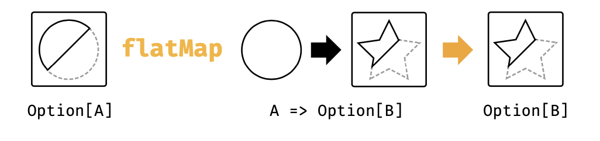
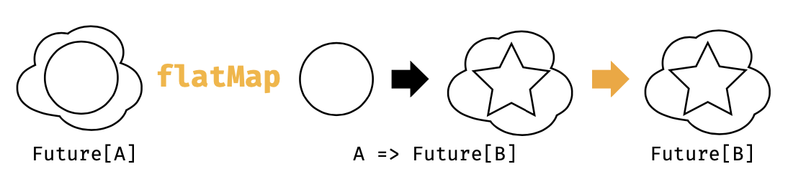

## 4.1 什么是Monad

这个问题已经在博客上吵烂了，解释和分析甚至都广泛到猫、墨西哥食品，太空服，这些内容充满了毒药的味道，以及monoid和endofunctor的分类。我们想要通过简单的解释monad来解决这个问题：

**monad是序列计算的一种机制**

就这么简单。问题解决了？但是，等等，上一章节我们说过functor是一种对相同事物的控制机制。是的，我们可能需要更多的讨论。

在3.1节，我们提到过functor允许我们序列化计算而忽略掉某些复杂性。然而，functor在允许序列化的开始只出现一次复杂性这件事情上是有限制的。他们并不能估计序列中的每一步的复杂性。

这就是monad需要引入的地方。monad的flatMap方法允许我们指定接下来要发生的事情，预估到一种中间的复杂性。Option的flatMap方法将中间的Option都考虑到。List的flatMap方法也会处理中间的List。等等。每一种情况，传递给flatMap的函数都会指定应用特定计算的部分，并且flatMap自身会照顾到的复杂性会阴虚我们重新使用flatMap。让我们先来看几个例子。

#### Option

Option允许我们序列化计算，而不论是否返回一个值。这里有一些例子：

`def parseInt(str: String): Option[Int] =
scala.util.Try(str.toInt).toOption
def divide(a: Int, b: Int): Option[Int] =
if(b == 0) None else Some(a / b)`

这种方法都可能由于 **错误** 而返回None. flatMap方法允许我们忽略这些：

`def stringDivied(aStr: String, bStr: String): Option[Int] =
parseInt(aStr).flatMap{
  aNum => parseInt(bStr).flatMap{bNum => divide(aNum, bNum)}
  }`

  
  
图4.1:类图:Option的flatMap方法

我们很清楚语法：

+ 第一次调用parseInt的时候返回None或者Some;
+ 如果返回了一个Some，那么flatMap方法调用我们的方法并且传入一个整型aNum作为参数；
+ 第二次调用parseInt返回一个None或者Some；
+ 如果返回了一个Some，那么flatMap方法会调用我们的方法传入bNum；
+ 然后调用divide返回一个None或者Some，这正是我们所需要的结果。

每一步，flatMap都会选择是否调用我们的函数，并且我们的函数会在序列中产生下一步的计算。这在图4.1中展现。

计算结果是一个Option，允许我们重新调用flatMap以便于序列计算得以继续。者导致了我们所理解和最爱的快速失败处理行为，在所有的步骤中，任何一个结果为None都会导致最终结果为None:

`stringDivideBy("6","2")
stringDivideBy("6","0")
stringDivideBy("6","foo")
stringDivideBy("bar","2")`

每一个monad同时也是一个functor（请参照下面的例子），因此我们可以依赖flatMap和map来进行序列化计算，这一点或许会或者不会引入一个新的monad。为了加强这一点，如果我们有flatMap和map，我们可以用来更加清晰的理解序列行为：

`def stringDivideBy(aStr: String, bStr: String):Option[Int] =
  for{
    aNum <- parseInt(aStr)
    bNum <- parseInt(bStr)
    ans <- divide(aNum, bNum)
    } yield ans`

#### List

当我们作为Scala新手第一次遇到flatMap的时候，我们倾向于认为这是List的一种迭代模式。这种感受会因为我们对语法的理解而加强，因为他们看起来更像命令式编程中的循环：

`for{
  x <- (1 to 3).toList
  y <- (4 to 5).toList

  } yield (x,y)`

然而，这其实是我们对List的凸显单子行为应用的另外一种思想模型。如果我们认为List是一组媒介结果，flatMap就变成了对计算排列和组合的构建。

举个例子，上面的for comprehension 中，x有三种可能的值，y有两种。这就意味着(x,y)有6中。flatMap从代码中生成了这些组合，其描述了序列化操作：

+ 获得x
+ 获得y
+ 产生一个tuple (x,y)

#### Future

Future是一种无需担心异步操作的序列计算：

`import scala.concurrent.Future
import scala.concurrent.ExecutionContext.Implicits.global

def doSomethingLongRunning: Future[Int]=???
def doSomethingElseLongRunning: Future[Int]=???

def doSomethingVeryLongRunning: Future[Int]=
for{
  result1 <- doSomethingLongRunning
  result2 <- doSomethingElseLongRunning
  } yield result1 + result2`

我们再次指定每次步骤运行的代码，flatMap关注于非常可怕的潜在的线程池和调度的复杂性。

如果你已经大范围的用过Future，你就会明白上面的代码实际上是在序列中运行每个操作。如果我们将for comprehension展开来显示对flatMap的嵌套调用，这就变得更加清晰：

`def doSomethingVeryLongRunning: Future[Int] =
doSomethingLongRunning.flatMap{result1 => doSomethingElseLongRunning.map{result1 => result1 + result2}}`

图4.2:类图:Future的flatMap方法

序列中的每一个Future会被从前面的Future结果接收的函数创建出来。换句话说，计算中的每一步只有当前面的步骤完成之后才能开始。在图4.2中可以看出类型为A=>Future的函数参数。

我们可以并行的执行future，但是那是另外一种场景，我们会在另择时机来说明。Monad全部都是相关序列的。

### 4.1.1 Monad的定义

当我们上面讨论flatMap，单子行为由下面两个操作组合：

+ 类型为A => F[A]的纯函数；
+ 类型为(F[A], A => F[B]) => F[B]的flatMap

pure抽象高于构造器，提供了从普通值中创建一个新单子上下文的方法。flatMap提供了我们前面讨论过了的序列步骤，从上下文中提取值，并且在序列中产生下一步的上下文。这里有Cats中的monad类型类的简化版本：

`import scala.language.higherKinds

trait Monad[F[_]]{
  def pure[A](value: A):F[A]
  def flatMap[A, B](value: F[A])(func: A => F[B])
  }`

> #### monad法则

> pure和flatMap必须遵守一组法则，其允许我们自由的序列化操作，而不用担心意外和副作用发生：

> Left identity: 调用pure并且通过func来转换结果：
> `pure(a).flatMap(func) == func(a)`

> Right identity:将pure传递给flatMap相当于什么都么有做：

> `m.flatMap(pure) == m`

>Associativity: 对函数f和g进行flatMap操作等同于对f进行flatMap操作然后在对g进行flatMap操作：

> `m.flatMap(f).flatMap(g) == m.flatMap(x => f(x).flatMap(g))`

### 4.1.2 练习：得到Func-y

每一个monad也是一个funtor。我们可以对每一个使用已存在的方法flatMap和pure的monad用相同的方法定义map：

`import scala.lauguage.higherKinds

trait Monad[F[_]]{
  def pure[A](a: A): F[A]
  def flatMap[A, B](value: F[A])(func: A => F[B]): F[B]
  def map[A, B](value: F[A])(func: A=>B):F[B] = ???
  }`

  我们来定义自己的map

#### D.1 获得Func-y

第一次看到这里，感觉就是一个小技巧，但是如果我们跟嘴我们将要看到的类型，就只有一种解决方法。我们被作为类型F[A]的值被传递。给定的可用工具其实就只有一招，那就是调用flatMap：

`trait Monad[F[_]]{

  def pure[A](value: A): F[A]
  def flatMap[A, B](value: F[A])(func: A=>F[B]): F[B]
  def map[A, B](value: F[A])(func: A => B): F[B] = flatMap(value)(a => ???)
  }`

  我们需要一个类型为 A=>F[B]的函数作为第二个参数。我们已经有了可用的构造块的两个函数：类型为A=>B的func参数和类型为 A => F[A]的pure函数。将这组合起来就是我们需要的结果：

  `trait Monad[F[_]]{
    def pure[A](value: A): F[A]
    def flatMap[A, B](value: F[A])(func: A => F[B]): F[B]
    def map[A, B](vale: F[A])(func: A => B):F[B] = flatMap(value)(a => pure(a)))
    }`

#
